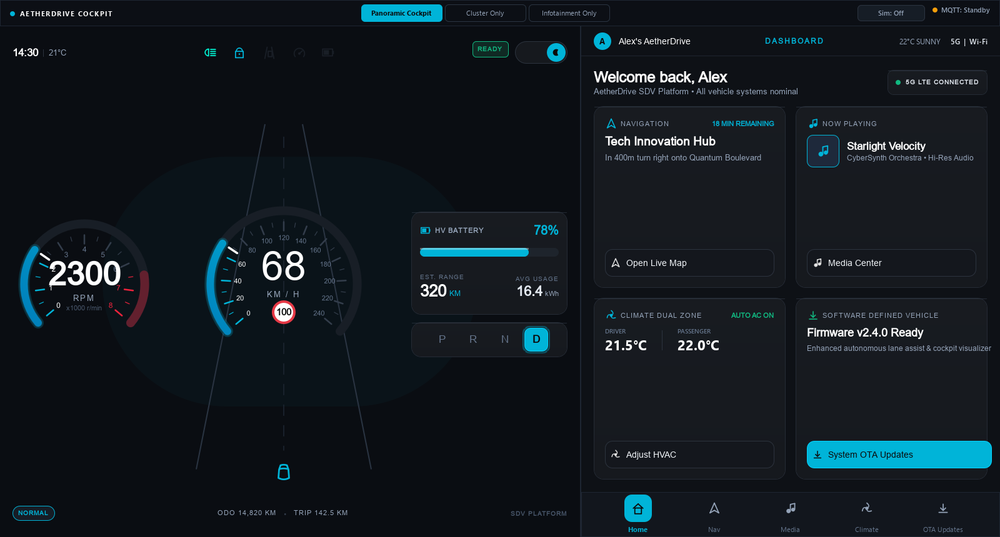
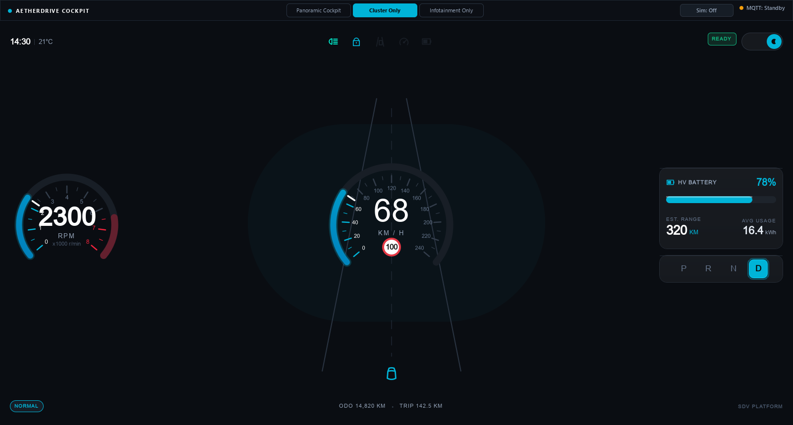
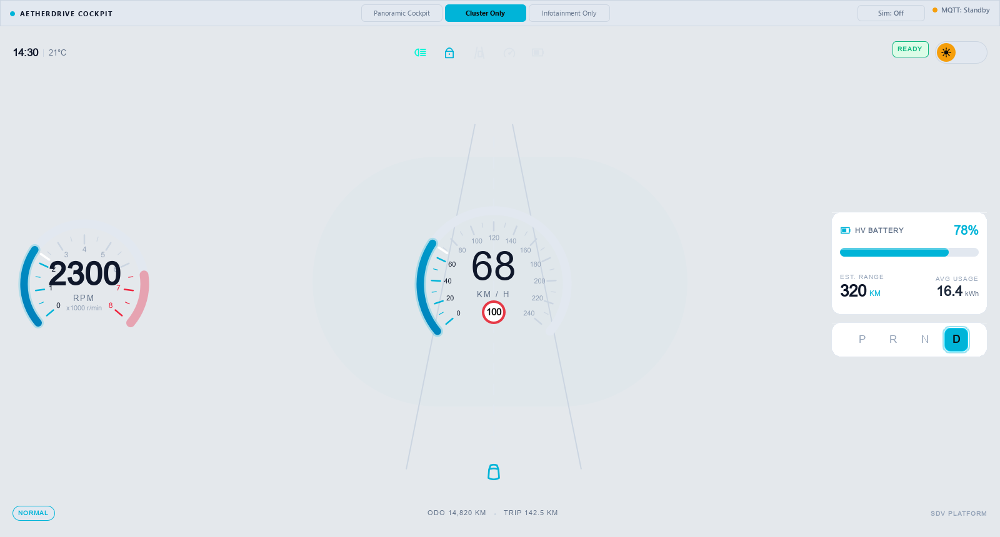
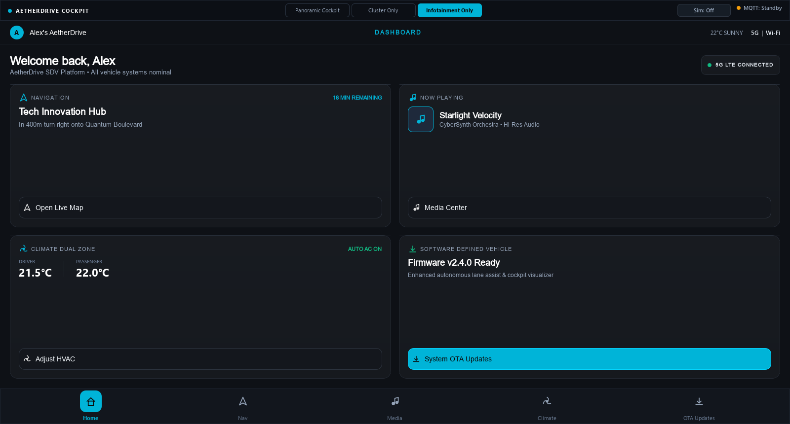
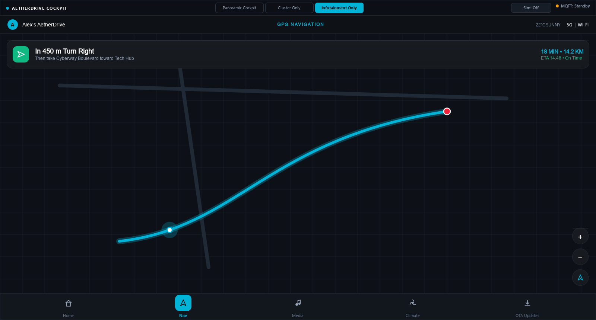
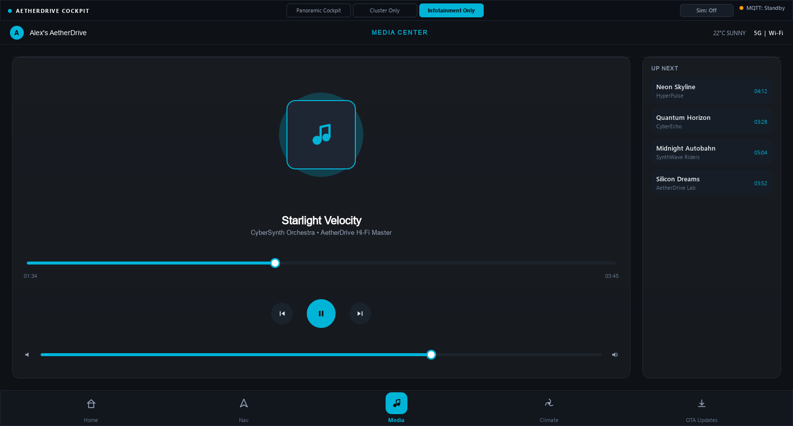
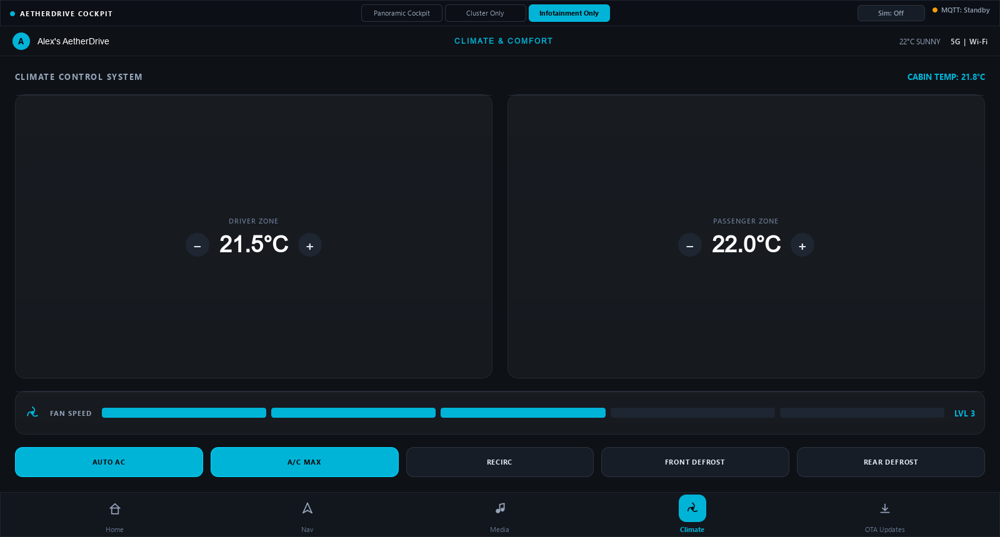
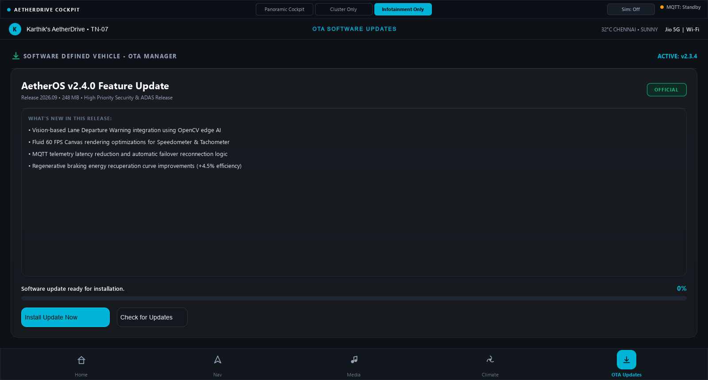

# AetherDrive – SDV Digital Cockpit & Connected Vehicle Platform

[]()
[]()
[]()
[]()
[]()
[]()

**AetherDrive** is an industry-aligned Software-Defined Vehicle (SDV) digital cockpit concept demonstrator built with **C++20 / Qt 6 QML** and **Python / PySide6**. It showcases modern automotive human-machine interface (HMI) design, real-time distributed telemetry over MQTT, simulated over-the-air (OTA) updates, and edge computer vision.

---

## Visual Showcase

### Panoramic Dual Cockpit (Night Mode)


### Cluster Modes (Night vs Day)
| Night Mode (Glanceable Contrast) | Day Mode (High Ambient Legibility) |
| :---: | :---: |
|  |  |

### Infotainment System
| Home Dashboard | Turn-by-Turn Navigation |
| :---: | :---: |
|  |  |

| Media & Audio Hub | Dual-Zone Climate Control |
| :---: | :---: |
|  |  |

| Connected SDV OTA Updates |
| :---: |
|  |

---

## Architectural Overview

AetherDrive separates concerns across distinct layers following modern automotive SDV architecture:

```
                  ┌──────────────────────────────────────────────┐
                  │      MQTT Broker (EMQX / Mosquitto)          │
                  │   aetherdrive/vehicle/data & alerts & ota    │
                  └──────────────┬──────────────────▲────────────┘
                                 │                  │
                Telemetry Feed   │                  │  Commands / Alerts
                                 ▼                  │
┌──────────────────────────────────────────────┐    │
│            AetherDrive HMI Layer             │    │
│  ┌────────────────────┬───────────────────┐  │    │
│  │ Digital Instrument │   Infotainment    │  │    │
│  │      Cluster       │    Centerstack    │  │    │
│  │ (Speed, RPM, Batt, │ (Nav, Media, HVAC,│  │    │
│  │  Gears, Warnings)  │    OTA Manager)   │  │    │
│  └─────────▲──────────┴─────────▲─────────┘  │    │
│            │ C++ TelemetryModel │             │    │
│  ┌─────────┴────────────────────┴─────────┐  │    │
│  │ Qt 6 / QML Canvas Engine & Controllers │  │    │
│  └────────────────────┬───────────────────┘  │    │
│                       │                      │    │
│               Native C++ / PySide6           │    │
└───────────────────────┼──────────────────────┘    │
                        │                           │
                        │                           │
┌───────────────────────▼───────────────────────────┴────────────┐
│                  Vehicle Dynamics & Edge AI                    │
│  ┌─────────────────────────────┐ ┌──────────────────────────┐  │
│  │  Vehicle Dynamics Simulator │ │ OpenCV Lane Departure AI │  │
│  │  - 10 Hz Physics Loop       │ │ - Canny & Hough ADAS     │  │
│  │  - Battery / Range Engine   │ │ - Real-time Alert Pub    │  │
│  └─────────────────────────────┘ └──────────────────────────┘  │
└────────────────────────────────────────────────────────────────┘
```

---

## Key Features

### 1. Automotive Digital Instrument Cluster
- **Smooth Analog-Digital Gauges**: Anti-aliased canvas gauges with gradient sweeps, sweep needles, dynamic center digital readouts, and tick-marks.
- **EV Powertrain Telemetry**: High-voltage battery percentage bar, dynamic estimated range calculation, real-time power consumption in kW, and PRND drive mode indicator.
- **Glanceable Warning Hierarchy**: Status bar with tire pressure indicators (FL, FR, RL, RR), door open state, check-engine icon, and high-priority alert banners.
- **Day/Night Ambient Theming**: Instant one-touch transition between Deep OLED Black (`#0A0A0A`) and Crisp High-Contrast Day Mode (`#EBF1F5`).

### 2. Multi-Screen Connected Infotainment
- **Home Dashboard**: Quick glance widgets for current speed, navigation target, current audio track, ambient climate, and system health status.
- **Turn-by-Turn Navigation**: Interactive vector map canvas with road network, GPS vehicle indicator, speed-limit sign, route banner, and destination ETAs.
- **Media & Audio Hub**: Dynamic album artwork canvas, playback controls (Play/Pause, Skip, Previous), track progress scrubber, volume slider, and playlist queue.
- **Dual-Zone Climate Control**: Independent driver & passenger temperature adjustment, 5-speed blower fan, AC/Recirculation toggles, and seat heaters.
- **SDV Over-The-Air (OTA) Updates**: Realistic automotive firmware rollout simulation, release notes inspector, download progress bar, cryptographic verification, and seamless cluster reboot.

### 3. High-Fidelity Vehicle Dynamics Simulator
- **Realistic EV Physics**: Implements continuous speed interpolation, regenerative braking dynamics, proportional RPM/motor curve, and realistic battery depletion.
- **Fault & Alert Injection**: Interactive CLI triggers simulated faults (e.g. low tire pressure, battery critical, door open, motor overheating) over MQTT.
- **Dual Implementation**: High-performance C++20 engine (`simulator/src/`) and zero-dependency Python publisher (`simulator/vehicle_simulator.py`).

### 4. Edge AI ADAS (Lane Departure Warning)
- Computer vision pipeline implemented in OpenCV.
- Real-time road camera analysis using Gaussian blur, Canny edge detection, Region of Interest (ROI) masking, and Hough Line Transforms.
- Calculates vehicle lateral offset and publishes warning events (`ALERT_LANE_DEPARTURE`) directly to the MQTT cockpit bus.

---

## MQTT Telemetry Contract

All systems communicate using JSON payloads over the following topics:

| Topic | Frequency | Direction | Description |
| :--- | :--- | :--- | :--- |
| `aetherdrive/vehicle/data` | 10 Hz | Sim ➔ Cockpit | Complete vehicle telemetry state (speed, rpm, battery, gear, climate, etc.) |
| `aetherdrive/vehicle/alert` | Event-driven | Sim/AI ➔ Cockpit | Emergency alerts (Lane departure, battery critical, door open, tire pressure) |
| `aetherdrive/vehicle/ota` | Event-driven | Cloud ➔ Cockpit | Firmware metadata, download progress, and installation triggers |
| `aetherdrive/vehicle/command` | Event-driven | Cockpit ➔ Sim | User control commands (HVAC target, drive mode, light toggle) |

#### Sample Telemetry Payload
```json
{
  "timestamp": 1726735200000,
  "speed": 74.5,
  "rpm": 4650.0,
  "battery_pct": 82.4,
  "range_km": 395.5,
  "gear": "D",
  "power_kw": 28.6,
  "odometer_km": 14238.1,
  "left_temp": 21.5,
  "right_temp": 22.0,
  "tire_pressure_psi": [34.8, 35.0, 34.9, 34.7],
  "door_open": false,
  "check_engine": false,
  "high_beam": false,
  "turn_signal": 0
}
```

---

## Quickstart Guide

### Option A: Python / PySide6 Instant Runner (Zero-Setup)

No C++ compiler or Qt installation required. Runs instantly with Python:

1. **Install Dependencies**:
   ```bash
   pip install PySide6 paho-mqtt opencv-python
   ```

2. **Launch the HMI Cockpit**:
   ```bash
   python hmi/hmi_runner.py
   ```
   *Keyboard Shortcuts in Cockpit*:
   - `F1`: Panoramic Dual Cockpit view (Cluster + Infotainment side-by-side)
   - `F2`: Dedicated Instrument Cluster view
   - `F3`: Dedicated Infotainment Centerstack view
   - `F5`: Toggle Day / Night mode
   - `F11`: Fullscreen toggle

3. **Launch the Vehicle Telemetry Simulator**:
   ```bash
   python simulator/vehicle_simulator.py
   ```
   *Interactive Simulator Controls*:
   - Press `1` to `4`: Trigger Drive Scenarios (City Cruising, Highway Sprint, Aggressive Acceleration, Braking)
   - Press `A`: Inject Low Tire Pressure fault
   - Press `B`: Inject Battery Low warning
   - Press `D`: Toggle Door Ajar alert
   - Press `C`: Clear active alerts

4. **(Optional) Run Edge AI Lane Departure Detector**:
   ```bash
   python simulator/lane_departure_detector.py
   ```

---

### Option B: Native C++20 + CMake Build

Requires:
- C++20 compliant compiler (MSVC 2019+, GCC 11+, or Clang 13+)
- CMake 3.20+
- Qt 6.5+ (Qt Quick, Qt Quick Controls 2, Qt Network)

1. **Configure and Build**:
   ```bash
   mkdir build && cd build
   cmake .. -DCMAKE_BUILD_TYPE=Release
   cmake --build . --config Release -j8
   ```

2. **Run the Executables**:
   ```bash
   # Launch HMI
   ./bin/AetherDriveHmi

   # Launch Vehicle Simulator
   ./bin/VehicleSimulator
   ```

---

## Project Structure

```
AetherDrive/
├── CMakeLists.txt                # Top-level CMake build configuration
├── README.md                     # Project documentation & visual guide
├── common/                       # Shared contracts & data models
│   ├── VehicleTelemetry.h        # C++ telemetry struct & JSON serialization
│   └── MqttTopics.h              # Unified MQTT topic definitions
├── simulator/                    # Vehicle Dynamics Engine & Edge AI
│   ├── CMakeLists.txt            # C++ simulator build
│   ├── src/
│   │   ├── main.cpp              # C++ simulator entrypoint
│   │   ├── VehicleSimulator.h    # EV physics & telemetry generator
│   │   └── VehicleSimulator.cpp
│   ├── vehicle_simulator.py      # Standalone Python MQTT publisher with CLI controls
│   └── lane_departure_detector.py # OpenCV Edge AI lane detection system
├── hmi/                          # Digital Cockpit HMI Application
│   ├── CMakeLists.txt            # C++ Qt 6 HMI build
│   ├── hmi_runner.py             # Instant PySide6 QML launcher
│   ├── src/                      # C++ Qt 6 backend
│   │   ├── main.cpp              # C++ application entry point
│   │   ├── VehicleTelemetryModel.h/.cpp # QML telemetry property model
│   │   ├── MqttClient.h/.cpp     # Qt MQTT broker connection handler
│   │   ├── ThemeController.h/.cpp# Automotive Day/Night theme manager
│   │   └── OtaManager.h/.cpp     # Firmware update lifecycle manager
│   └── qml/                      # Automotive QML visual hierarchy
│       ├── Main.qml              # Panoramic master viewport & split controller
│       ├── controls/             # Reusable automotive UI components
│       │   ├── AetherCard.qml    # Glassmorphism container with accents
│       │   ├── AetherButton.qml  # Responsive tactile button
│       │   ├── AetherSlider.qml  # Precision touch slider
│       │   └── AetherIcon.qml    # 100% Vector Canvas automotive icon library
│       ├── cluster/              # Instrument Cluster screens & widgets
│       │   ├── ClusterView.qml   # Master instrument cluster layout
│       │   ├── GaugeSpeedometer.qml # Circular sweep speedometer (0-240 km/h)
│       │   ├── GaugeTachometer.qml  # Circular sweep tachometer (0-8000 RPM)
│       │   ├── BatteryRangeWidget.qml # EV SoC & power readout
│       │   ├── GearIndicator.qml # PRND active gear selector
│       │   ├── WarningBar.qml    # TPMS & safety warning bar
│       │   └── DayNightToggle.qml# Day/Night theme switch
│       └── infotainment/         # Centerstack Infotainment screens
│           ├── InfotainmentView.qml # Navigation drawer & screen stack
│           ├── HomeScreen.qml    # Master multi-widget overview
│           ├── NavigationScreen.qml # Turn-by-turn navigation & route card
│           ├── MediaScreen.qml   # Track artwork, scrubber & queue
│           ├── ClimateScreen.qml # Dual-zone HVAC & seat heating
│           └── OtaScreen.qml     # SDV Over-The-Air firmware updater
├── docs/
│   └── screenshots/              # High-resolution rendered screenshots
└── scripts/
    └── capture_screenshots.py    # Automated Qt offscreen visual testing harness
```

---

## Design Standards & UX Philosophy

- **Automotive Glanceability & Visual Hierarchy**: Visual hierarchy prioritizes speed, driving mode, and active safety alerts. Critical parameters are readable within a 300 ms driver glance.
- **Responsive Panoramic Form Factor**: Fluid layout adapts dynamically across standard desktop displays up to ultra-wide 32:9 automotive panoramic displays.
- **Zero Asset Dependencies**: All gauge sweeps, needles, icons, and diagrams are procedurally drawn with hardware-accelerated QML Canvas. No missing bitmap assets or scaling artifacts on high-DPI displays.
- **Dark Mode Primary**: Uses `#0A0A0A` deep OLED blacks to eliminate driver eye strain during nighttime driving, paired with `#00B4D8` electric blue cybernetic accents and amber/crimson alert channels.
- **Architectural Scope & Safety Context**: AetherDrive is designed as an architectural prototype and HMI concept demonstrator. In real-world production vehicle architectures, safety-critical telltales and hard real-time alerts operate under ISO 26262 functional safety constraints on isolated ASIL-rated microcontrollers (e.g., AUTOSAR Classic on Infineon Aurix), while the high-fidelity graphical cluster and infotainment run on Linux/QNX on application SoCs.

---

## Regional Personalization (Tamil Nadu, India)

The demonstrator includes localized context reflecting modern connected vehicle driving in South India:
- **Navigation**: Turn-by-turn guidance along Chennai's **OMR IT Corridor (Rajiv Gandhi Salai ➔ Tidel Park)** with realistic 80 km/h highway speed limits.
- **Tropical Climate System**: **32°C outside temperature** with rapid dual-zone cooling presets and cabin air recirculation.
- **Connected Services**: Jio 5G network integration, driver profile (**Karthik's AetherDrive • TN-07**), and regional Tamil audio playlist.

---

## License

This project is licensed under the MIT License.
